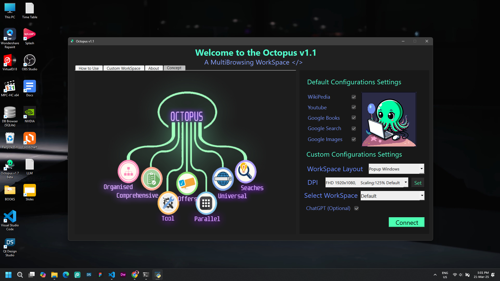
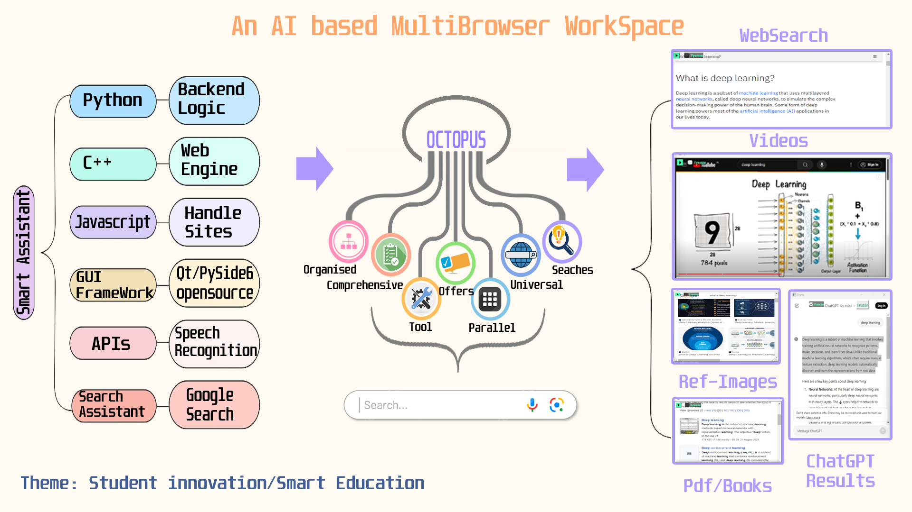
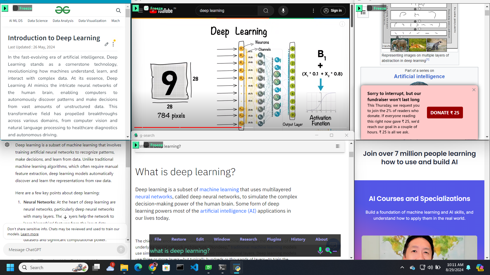
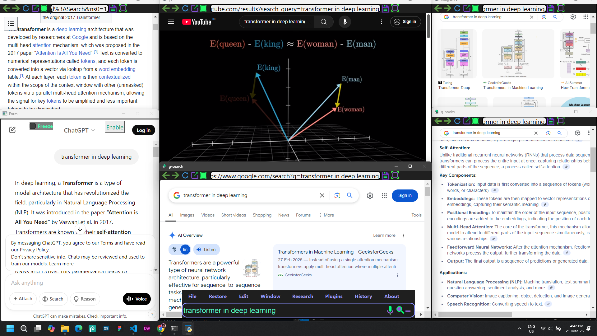

# Octopus-v1.7-Multi-Search-Ai-Browser
Octopus v1.7 is an ai based internet browser in which user can gather information from multiple platforms in realtime parallely.

### 1. IDEA Concept

## Application Screenshots

### 2. Title

### 3. UI Home

### 4. Drag & Drop Notes from Websites

### 5. Intro Banner

### 6. Layout Designer

### 7. Notes Maker

### 8. Overview 1

### 9. Overview 2

### 10. Overview 3

### 11. Private Workspace

